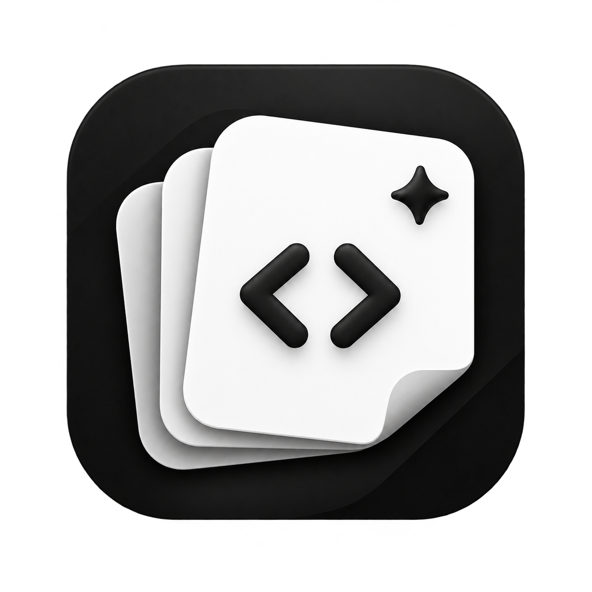
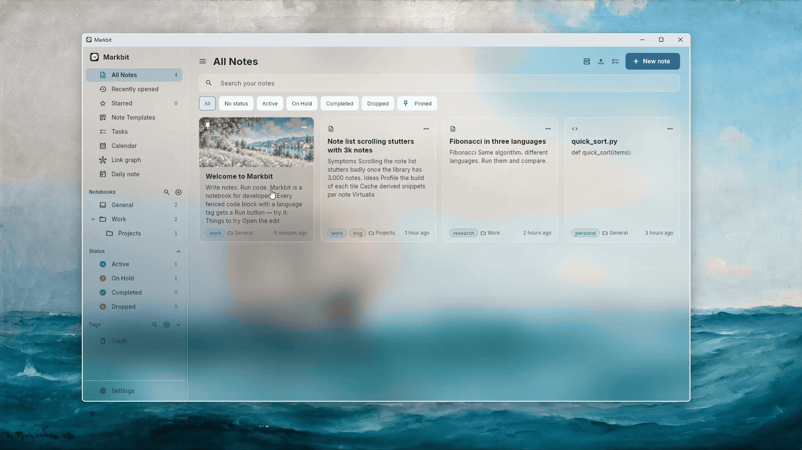
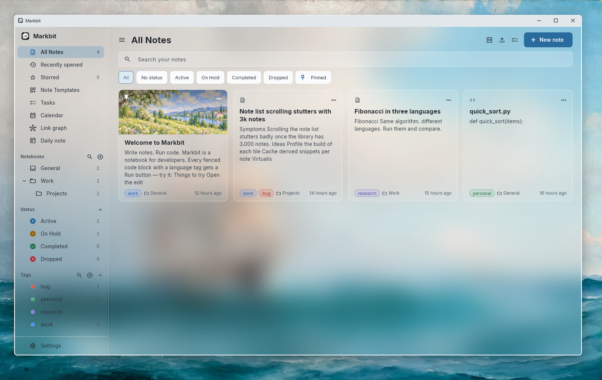
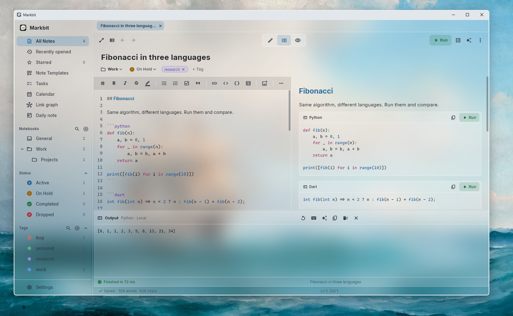
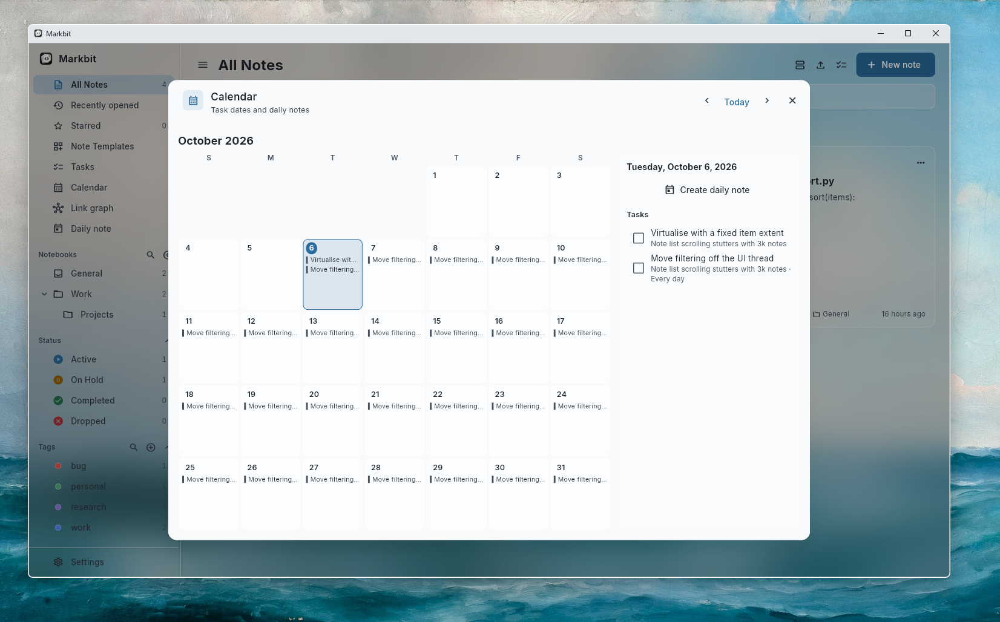
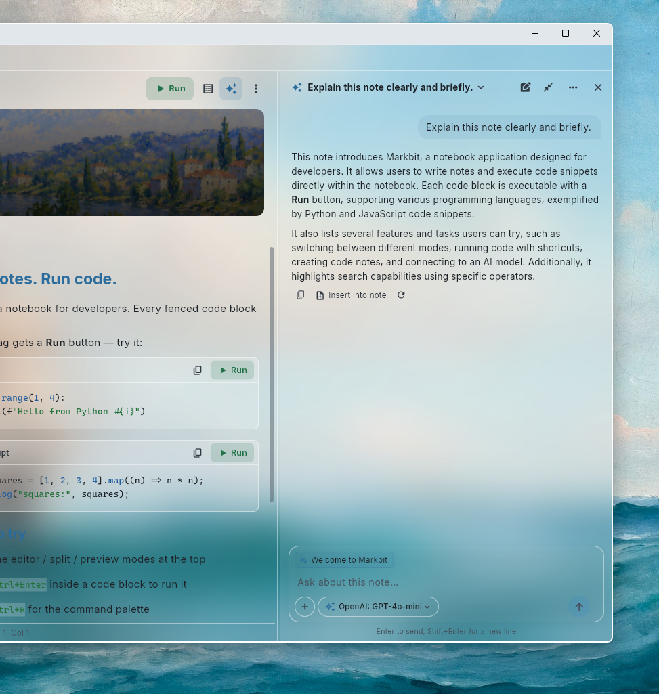
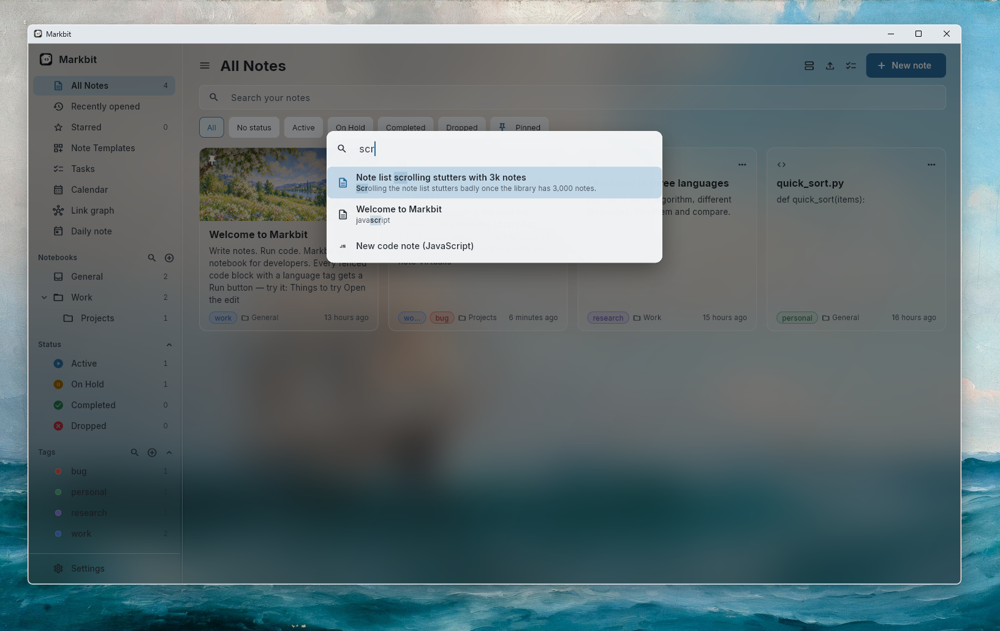

<div align="center">



# Markbit

**Markdown notes that run code.**
A fast, offline-first notebook for developers — write notes, run the code inside them, plan your tasks and ask AI about it, all in one app.

[](https://github.com/NURULLAHTURGUT/markbit/actions/workflows/validation.yml)


[](LICENSE)

<p>
  <a href="https://github.com/NURULLAHTURGUT/markbit/releases/latest"></a>
  <a href="https://github.com/NURULLAHTURGUT/markbit/releases/latest"></a>
  <a href="https://github.com/NURULLAHTURGUT/markbit/releases/latest"></a>
</p>

[**Download**](#-download) · [Features](#-features) · [Build from source](#-build-from-source) · [Contributing](#-contributing)



</div>

---

## Why Markbit?

Most note apps treat code as text. Markbit treats it as **something you can run**.

- 📝 **Write** in Markdown with live preview, math, diagrams and charts.
- ▶️ **Run** any fenced code block — Python, JavaScript, Go, Rust, SQL and 15+ more — right inside the note.
- ✅ **Plan** with tasks, due dates, repeating reminders and a calendar.
- 🤖 **Ask AI** about the note you are editing, with any OpenAI-compatible provider — including fully local models.
- 🔒 **Own your data**: plain JSON files on your disk, no account, no telemetry, no cloud required.

---

## ✨ Features

### Notes & editor
- Markdown editor with syntax highlighting, line numbers, smart lists, and **edit / split / preview** modes
- **Math** (`$…$`, `$$…$$`), **Mermaid** diagrams, footnotes, tables, image galleries, colored text
- Editable **mind maps** and **bar / line / donut charts**
- `[[Wiki links]]`, backlinks, an outline panel and an interactive **link graph**
- Note covers, pinned and starred notes, status (Active / On hold / Completed / Dropped)
- Nested **notebooks**, hierarchical **tags** (`project/frontend`), tag merging
- **Templates** with variables (`{{date}}`, `{{weekday}}`, `{{cursor}}`…) and **daily notes**
- Tabs, side-by-side notes, **separate note windows**, focus mode and a command palette

<p align="center"></p>


### Run code where you write it
Every fenced block with a language tag gets a **Run** button (`Ctrl+Enter` inside a block). Output, errors, exit code and timing stream into a console panel, with stdin support.

- **Desktop:** uses the compilers and interpreters already on your PATH — Python, JavaScript, TypeScript, Dart, Java, Kotlin, C, C++, C#, Go, Rust, Ruby, PHP, Lua, Perl, Bash, PowerShell, Swift, R
- **SQL:** runs locally with a bundled SQLite engine — blocks in a note share one database, so `CREATE`, `INSERT` and `SELECT` just work
- **Remote (optional):** point Markbit at your own [Piston](https://github.com/engineer-man/piston) server. Nothing is sent anywhere unless you configure it.

<p align="center"></p>


### Tasks, reminders & calendar
- Checkboxes become tasks with **due dates, priorities and repeat rules** (daily, weekdays, weekly, monthly, yearly)
- **System notifications** — reminders arrive even when Markbit is minimized or closed
- Task dashboard with **Today / This week / Overdue** views
- Monthly **calendar** with tasks, repeating occurrences and daily notes

<p align="center"></p>


### AI assistant
- Works with **any OpenAI-compatible API**: OpenAI, OpenRouter, Groq, Gemini, Mistral, DeepSeek, or **local models via Ollama / LM Studio**
- Sees the note you are editing; add other notes or files as extra context
- Proposes edits to your note that you **review and approve** before anything is written
- Creates charts and mind maps, writes tests, explains and fixes code

<p align="center"></p>
- Multiple conversations per note, model and reasoning-effort picker


### Find anything
Fast, typo-tolerant search with filters:

```text
tag:work status:active lang:python has:tasks updated:week -draft
```

`tag:` `notebook:` `status:` `kind:` `lang:` `is:pinned|starred|locked` `has:code|tasks|images|cover` `created:` / `updated:` (`today`, `week`, `month`, `>2026-01-01`) · exclude with `-word` · combine with `OR`. Save any search as a **collection** in the sidebar.

<p align="center"></p>


### Your data, safely
- One **plain JSON file per note**, written atomically — readable and yours
- **Version history** for every note with a side-by-side diff and one-click restore
- **Password-locked notes** (encrypted on disk)
- Trash with automatic cleanup, **full backups** (`.markbit`) and **daily automatic backups**
- Changes made to the files by other programs are detected and merged safely

### Import & export
- **Import** from Obsidian vaults, Notion exports, Evernote (`.enex`), Joplin (`.jex`), Markdown files and folders
- **Export** a note as Markdown, HTML, Word (`.docx`) or PDF — or the whole library as Markdown or a static website

### Make it yours
- Themes: **Light, Dark, Glass (light & dark), Solarized, Nord, Dracula** — Glass uses the native Windows blur
- Languages: **English, Türkçe, Deutsch, Español**
- Rebindable keyboard shortcuts and interface scaling (80–150%)


---

## 📥 Download

<p align="center">
  <a href="https://github.com/NURULLAHTURGUT/markbit/releases/latest"></a>
  <a href="https://github.com/NURULLAHTURGUT/markbit/releases/latest"></a>
  <a href="https://github.com/NURULLAHTURGUT/markbit/releases/latest"></a>
</p>

Every release on the [**Releases page**](https://github.com/NURULLAHTURGUT/markbit/releases/latest) has a download for each platform:

| Platform | Download | Requirements |
| --- | --- | --- |
| **Windows** | `Markbit-Setup-<version>-x64.exe` (installer, recommended) or `Markbit-<version>-x64-portable.zip` | Windows 10 or 11, 64-bit |
| **macOS** | `Markbit-<version>-macos.zip` | macOS 10.15 or later, Apple silicon or Intel |
| **Linux** | `Markbit-<version>-linux-x64.tar.gz` | 64-bit, GTK 3 (Ubuntu 22.04+, Fedora, Debian, …) |

### Windows

Run the installer: it installs for your user without administrator rights (or for all users, if you choose), adds Start menu and optional desktop shortcuts, and upgrades or uninstalls from *Settings → Apps*. Setup is available in English, Türkçe, Deutsch and Español, and Markbit starts in the language you picked. Prefer no installation? Unzip the portable zip anywhere and run `markbit.exe`.

> **SmartScreen:** Markbit is not code-signed yet, so Windows may show *"Windows protected your PC"* on first launch. Click **More info → Run anyway**.

### macOS

Unzip the download and move **Markbit** to your *Applications* folder.

> **First launch:** Markbit is not notarized by Apple yet, so macOS may say it *"cannot be opened because the developer cannot be verified"*. Right-click (or Control-click) **Markbit** in *Applications*, choose **Open**, then **Open** again. You only need to do this once.

### Linux

```bash
tar -xzf Markbit-<version>-linux-x64.tar.gz
./Markbit-<version>/markbit
```

Markbit needs GTK 3 and libsecret, which most desktops already include. On Ubuntu or Debian, file dialogs also need `zenity`:

```bash
sudo apt install libgtk-3-0 libsecret-1-0 zenity
```

### Where your notes live

Uninstalling Markbit never deletes your notes. They are stored in:

| Platform | Folder |
| --- | --- |
| Windows | `%APPDATA%\io.github.turgut\Markbit` |
| macOS | `~/Library/Application Support/io.github.turgut.markbit/Markbit` |
| Linux | `~/.local/share/io.github.turgut.markbit/Markbit` |


> **Windows SmartScreen:** Markbit is not code-signed yet, so Windows may show *"Windows protected your PC"* on first launch. Click **More info → Run anyway**. You can always build it yourself from source.

Your notes live in `%APPDATA%\io.github.turgut\Markbit` on Windows — uninstalling the app does not delete them.

---

## ⌨️ Keyboard shortcuts

| Action | Shortcut |
| --- | --- |
| Command palette / quick open | `Ctrl+K` / `Ctrl+P` |
| New note / new Python code note | `Ctrl+N` / `Ctrl+Shift+N` |
| Find (notes or in note) / replace | `Ctrl+F` / `Ctrl+H` |
| Editor / split / preview | `Ctrl+1` / `Ctrl+2` / `Ctrl+3` |
| Run code block at cursor | `Ctrl+Enter` |
| AI assistant | `Ctrl+J` |
| Toggle sidebar / focus mode | `Ctrl+\` / `Ctrl+Shift+F` |
| Next / previous tab, close tab | `Ctrl+Tab` / `Ctrl+Shift+Tab`, `Ctrl+W` |
| Jump to tab 1–9 | `Alt+1` … `Alt+9` |
| Back / forward | `Alt+←` / `Alt+→` |
| Zoom interface in / out / reset | `Ctrl+=` / `Ctrl+-` / `Ctrl+0` |
| Settings | `Ctrl+,` |

On macOS, use **⌘ Cmd** instead of **Ctrl** (Markdown suggestions stay on **Ctrl+Space**). All shortcuts can be changed in **Settings → Keyboard shortcuts**.

---

## 🔐 Privacy

Markbit has **no account, no telemetry and no analytics**. Everything stays on your device unless you turn on a feature that needs the network:

- **AI assistant** — sends your question, the open note and any context you add to the provider *you* configure.
- **Remote code execution** — sends the code you run to the Piston server *you* configure (off by default).
- **HTML export** — exported pages load KaTeX / Mermaid from a CDN when the note uses math or diagrams.
- **Web images** — an image in a note that points to a web address (``) is downloaded when the preview shows it.

API keys are stored in the operating system's secure storage and are never included in backups.

> ⚠️ Markbit runs code on your computer when you press **Run**. Imported or shared notes never run anything on their own — but only run code you trust.

---

## 🛠️ Build from source

**Requirements:** [Flutter 3.47.6](https://docs.flutter.dev/get-started/install) (stable) plus the desktop toolchain of your platform:

- **Windows:** Visual Studio with the *Desktop development with C++* workload
- **macOS:** Xcode
- **Linux:** `sudo apt install clang cmake ninja-build pkg-config libgtk-3-dev libsecret-1-dev`

```bash
git clone https://github.com/NURULLAHTURGUT/markbit.git
cd markbit
flutter pub get
flutter run -d windows   # or: -d macos, -d linux
```

Release builds:

| Platform | Command | Output |
| --- | --- | --- |
| Windows | `flutter build windows --release` | `build/windows/x64/runner/Release/` |
| macOS | `flutter build macos --release` | `build/macos/Build/Products/Release/Markbit.app` |
| Linux | `flutter build linux --release` | `build/linux/x64/release/bundle/` |

On Windows and Linux, copy the whole output folder to run Markbit on another computer.

Run the checks used by CI:

```bash
flutter analyze
flutter test
```

### Project structure

```text
lib/
├── app/            App shell, theme and startup
├── application/    State (Riverpod): library, tasks, AI, persistence
├── core/           Theme tokens, shared widgets, localization
├── data/           Storage, backups, import / export
├── domain/         Pure logic: search, tasks, Markdown, code execution
└── features/       UI: editor, preview, sidebar, AI panel, settings…
```

---

## 🤝 Contributing

Contributions are very welcome — bug reports, ideas, translations and code. Read the [contributing guide](CONTRIBUTING.md) and the [code of conduct](CODE_OF_CONDUCT.md) to get started.

1. Open an [issue](https://github.com/NURULLAHTURGUT/markbit/issues) to report a bug or discuss a feature
2. Fork the repo and create a branch: `git checkout -b feature/my-idea`
3. Make sure `flutter analyze` and `flutter test` pass
4. Open a pull request

**Good first contributions**

- 🌍 Improve the German and Spanish translations (`lib/core/l10n/`) or add a new language
- 📱 Help bring Markbit to Android and iOS
- 🐞 Pick an issue labeled `good first issue`

Found a security problem? Please report it privately — see [SECURITY.md](SECURITY.md).

---

## 🗺️ Roadmap

- [ ] Sync between devices (e.g. via a folder or Git)
- [ ] Spell check
- [ ] Signed Windows builds
- [ ] Android and iOS releases
- [ ] Plugin / extension API

---

## 📄 License

Markbit is released under the [Apache License 2.0](LICENSE).

Copyright © 2026 Nurullah Turgut

## 🙏 Acknowledgements

Built with [Flutter](https://flutter.dev) and [Riverpod](https://riverpod.dev). Uses [Inter](https://rsms.me/inter/) and [Noto Sans](https://fonts.google.com/noto) (SIL Open Font License), [flutter_math_fork](https://pub.dev/packages/flutter_math_fork), [SQLite](https://sqlite.org) and many other open source packages — thank you to their authors.

<div align="center">

If Markbit is useful to you, consider giving it a ⭐ — it helps others find it.

</div>
